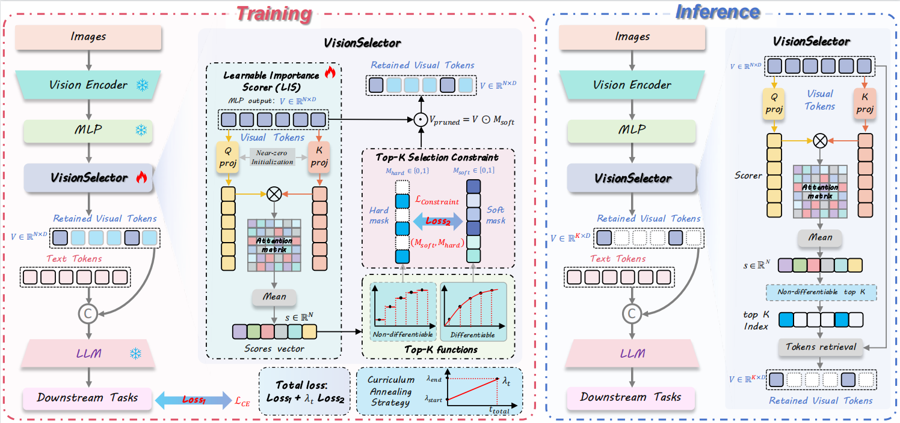

<h1 align="center">

VisionSelector: End-to-End Learnable Visual Token Compression for Efficient Multimodal LLMs
</h1>

<p align="center">
  📄  <a href="http://arxiv.org/abs/2510.16598"><strong>Paper</strong></a> |  
  🤗 <a href="https://huggingface.co/JulietChoo/VisionSelector-Qwen2.5-VL-3B"><strong>VisionSelector-Qwen2.5-VL-3B</strong></a>
  🤗 <a href="https://huggingface.co/JulietChoo/VisionSelector-Qwen2.5-VL-7B"><strong>VisionSelector-Qwen2.5-VL-7B</strong></a>
  🤗 <a href="https://huggingface.co/JulietChoo/VisionSelector-LLaVA-OV-1.5-8B"><strong>VisionSelector-LLaVA-OV-1.5-8B</strong></a>
</p>

<p align="center">
    <a href="">Jiaying Zhu<sup>1</sup></a>, 
    <a href="">Yurui Zhu*<sup>2</sup></a>, 
    <a href="">Xin Lu<sup>1</sup></a>, 
    <a href="">Wenrui Yan<sup>2</sup></a>, 
    <a href="">Dong Li<sup>1</sup></a>, 
    <a href="">Kunlin Liu<sup>2</sup></a>, 
    <a href="">Xueyang Fu*<sup>1</sup></a>, 
    <a href="">Zheng-Jun Zha<sup>1</sup></a>

</p>
<p align="center"><sup>1</sup>University of Science and Technology of China, <sup>2</sup>ZTE Corporation</p>
<p align="center">*Equal Advising</p>

# 📝 To do list

- [X] Release training code
- [X] Release evaluation code
- [X] Release comparison method code
- [X] Release model weights
- [X] Release inference code

---

# 👀 Overview

We introduce **VisionSelector**, a novel, **end-to-end learnable framework** that fundamentally re-casts visual token compression as an optimization-driven decision process. VisionSelector seamlessly integrates into existing MLLMs without modifying the backbone, achieving adaptive and superior efficiency.

Our key technical innovations include:

* A **Differentiable Top-K Selection Mechanism** that ensures end-to-end gradient flow while maintaining full compatibility with high-performance acceleration kernels like **FlashAttention**.
* A **Curriculum Annealing Strategy** with a composite loss, which effectively bridges the performance gap between soft training selection and hard inference selection.
* A **backbone-decoupled Learnable Importance Scorer (LIS)** that enables models, trained at a single compression rate, to **robustly generalize** to various compression budgets during inference.

VisionSelector is highly efficient, requiring only 12.85M trainable parameters. It achieves substantial performance-efficiency advancements: a 12.14% performance gain at 10% token retention, and a **1.73× prefill acceleration** (with 86.08% memory reduction) at 20% retention. VisionSelector consistently outperforms state-of-the-art baselines across 13 image and video understanding benchmarks.

<div align="center">
  
</div>

# 💾 Dataset Preparation and Configuration

To reproduce our results and train the VisionSelector module, you need to download and configure the following datasets from the `nyu-visionx/Cambrian-10M` repository.

## 1\. Dataset Downloading

Please download the following datasets and annotations and place them under the `datasets/` folder.

| Dataset           | Size                 | Download Link (Hugging Face)                                                                                      |
| :---------------- | :------------------- | :---------------------------------------------------------------------------------------------------------------- |
| **OCR_VQA** | $\sim 80\text{K}$  | [ocr_vqa.tar.gz](https://huggingface.co/datasets/nyu-visionx/Cambrian-10M/resolve/main/ocr_vqa.tar.gz?download=true) |
| **ChartQA** | $\sim 28\text{K}$  | [chartqa.tar.gz](https://huggingface.co/datasets/nyu-visionx/Cambrian-10M/resolve/main/chartqa.tar.gz?download=true) |
| **TextQA**  | $\sim 21\text{K}$  | [textvqa.tar.gz](https://huggingface.co/datasets/nyu-visionx/Cambrian-10M/resolve/main/textvqa.tar.gz?download=true) |
| **COCO**    | $\sim 364\text{K}$ | [coco.tar.gz](https://huggingface.co/datasets/nyu-visionx/Cambrian-10M/resolve/main/coco.tar.gz?download=true)       |

| Annotation             | Download Link (Hugging Face)                                                                                                    |
| :--------------------- | :------------------------------------------------------------------------------------------------------------------------------ |
| **Cambrian737K** | [Cambrian737k.jsonl](https://huggingface.co/datasets/nyu-visionx/Cambrian-10M/resolve/main/jsons/Cambrian737k.jsonl?download=true) |

### Generating Dataset Annotations:

The large annotation file (`Cambrian737k.jsonl`) needs to be split into individual JSONL files for each target dataset (OCR_VQA, ChartQA, COCO) to match the required directory structure.

Execute the following commands from the project root to perform this filtering and splitting using the `filter_json.py` script:

```bash
cd VisionSelector
python datasets/filter_json.py
python datasets/sample_merge_json_llavaov.py # for llava-ov-1.5
```

### Required Directory Structure:

After downloading and extracting, your project directory should contain the following structure:

```python
VisionSelector/
└── datasets/
    ├── ocr_vqa/
    ├── ocr_vqa_cambrian.jsonl
    ├── chartqa/
    ├── chartqa_cambrian.jsonl
    ├── textvqa/
    ├── textvqa_cambrian.jsonl
    ├── coco/
    ├── coco_cambrian.jsonl
    └── textvqa_ocrvqa_cambrian.jsonl
```

## 2\. Dataset config for training

The data paths and annotation paths for training are defined in `VisionSelector/qwen-vl-finetune/qwenvl/data/__init__.py`.

```python
DATASET_NAME = {
    "annotation_path": "/path/to/annotations.json",
    "data_path": "/path/to/image/data",
}
```

# 🔧 Installation - Qwen2.5VL

## 1\. Environment and Basic Dependencies

We recommend setting up a dedicated Conda environment.

```bash
conda create -n visionselector python=3.10
conda activate visionselector
```

## 2\. Package Installation

Navigate to your project root directory (`VisionSelector`) and install the required packages.

```bash
cd VisionSelector
pip install qwen-vl-utils[decord]
pip install -r requirements.txt
pip install transformers==4.50.0
```

### Recommended Package Versions:

For optimal compatibility, we recommend the following package versions:

| Package          | Recommended Version |
| :--------------- | :------------------ |
| `torch`        | `2.6.0`           |
| `torchvision`  | `0.21.0`          |
| `transformers` | `4.50.0`          |
| `deepspeed`    | `0.16.4`          |
| `flash_attn`   | `2.7.4.post1`     |
| `triton`       | `3.2.0`           |
| `accelerate`   | `1.4.0`           |
| `torchcodec`   | `0.2`             |

---

# 🚀 Quick Start - Qwen2.5VL

## 1\. Training

To train the VisionSelector (e.g., integrated with Qwen2.5-VL-7B) to learn crucial token selection, execute the script in the qwen-vl-finetune directory.

```bash
cd VisionSelector/qwen-vl-finetune
bash scripts/sft_7b.sh # for VisionSelector-Qwen2.5-VL-7B
bash scripts/sft_3b.sh # for VisionSelector-Qwen2.5-VL-3B
bash scripts/sft_dynamic.sh # Reimplementation of Dynamic-LLaVA's image predictor on Qwen2.5VL(Dynamic-Qwen)
```

## 2\. Evaluation, Inference and Visualizations

We utilize `lmms-eval` for comprehensive benchmarking.

### Setup `lmms-eval`

First, set up the evaluation environment:

```bash
cd VisionSelector/lmms-eval
pip install -e .
cd ../qwen-evaluation
```

### Run Evaluations

Use the provided scripts to evaluate VisionSelector against comparison methods and generate visualizations.

| Command                           | Purpose                                                                |
| :-------------------------------- | :--------------------------------------------------------------------- |
| `bash run_token_compression.sh` | Evaluation for Original Model and Comparison Token Compression Methods |
| `bash run_selector.sh`          | Evaluation for the **VisionSelector** Method                      |
| `bash run_dynamic_qwen.sh`      | Evaluation for the Dynamic-Qwen Method                                 |

To capture `Max GPU Memory`, `Prefill Time`, `Latency Time` and `Number of visual tokens`, set the following environment variable before running the evaluation script:

```bash
EVAL_TIME=True
```
### Run Inference

You can test different token pruning methods (VisionZip, DivPrune) and VisionSelector inference with this script:

```bash
bash run_inference.sh
```

### Visualizations

To generate activation heatmaps and token pruning visualizations:

```bash
bash run_visual.sh # for VisionZip, DivPrune and VisionSelector
```

---

# 🔧 Installation - LLaVA-OV-1.5

## 1\. Environment, Basic Dependencies and Package Installation

To ensure compatibility with the LLaVA-OneVision-1.5 framework, activate the pre-created `visionselector` environment first and then adjust the `transformers` package version as follows:

```bash
conda activate visionselector
pip uninstall transformers
pip install transformers==4.53.1
```

# 🚀 Quick Start - LLaVA-OV-1.5

## 1\. Training

To train the VisionSelector (e.g., integrated with LLaVA-OneVision-1.5) to learn crucial token selection, execute the script in the llava-ov-15 directory.

```bash
cd VisionSelector/llava-ov-15
bash scripts/finetune_selector_8b.sh # for LLaVA-OneVision-1.5
```

## 2\. Evaluation

```bash
cd llava-ov-15
bash run_ov_token_compression.sh # for orignal model and comparison method
bash run_ov_selector.sh # for VisionSelector
```

## 3\. Inference
```bash
bash run_ov_inference.sh
```

# Cititation
If this work contributes to your research, please cite:
```
@misc{zhu2025visionselectorendtoendlearnablevisual,
      title={VisionSelector: End-to-End Learnable Visual Token Compression for Efficient Multimodal LLMs}, 
      author={Jiaying Zhu and Yurui Zhu and Xin Lu and Wenrui Yan and Dong Li and Kunlin Liu and Xueyang Fu and Zheng-Jun Zha},
      year={2025},
      eprint={2510.16598},
      archivePrefix={arXiv},
      primaryClass={cs.CV},
      url={https://arxiv.org/abs/2510.16598}, 
}
```
# Acknowledgement

This work is built upon the foundational contributions of several excellent open-source projects. We express our sincere gratitude to the developers of the following resources, which were instrumental in the development and evaluation of **VisionSelector**:

- **Foundational Platforms:** [Qwen2.5-VL](https://github.com/QwenLM/Qwen3-VL/tree/main/qwen-vl-finetune), [LLaVA-OneVision-1.5](https://github.com/EvolvingLMMs-Lab/LLaVA-OneVision-1.5), [EffiVLM-Bench](https://github.com/EffiVLM-Bench/EffiVLM-Bench), and [Lmms-Eval](https://github.com/EvolvingLMMs-Lab/lmms-eval).
- **Inspirational Methods:** We also gratefully acknowledge the valuable insights and prior work provided by [FastV](https://github.com/pkunlp-icler/FastV), [PruMerge+](https://github.com/42Shawn/LLaVA-PruMerge), [VisionZip](https://github.com/dvlab-research/VisionZip), [DART](https://github.com/ZichenWen1/DART), [DivPrune](https://github.com/vbdi/divprune), [Dynamic-LLaVA](https://github.com/Osilly/dynamic_llava) and [Differentiable Top-K](https://math.stackexchange.com/q/4506773).


